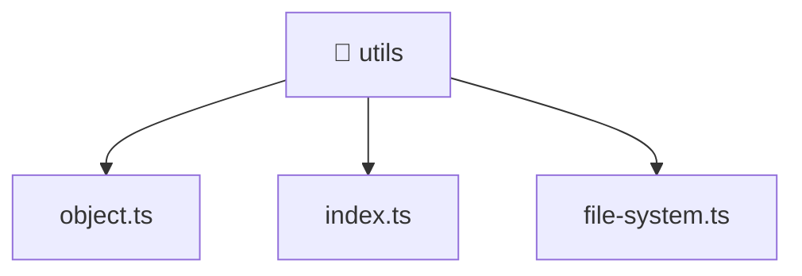

[🏠 Home](../../../../README.md) > [backend](../../../README.md) > [src](../../README.md) > [common](../README.md) > [utils](./README.md)

# 📁 utils

### 🎯 PURPOSE
Welcome to the exquisite **utils** module of the Mavluda Beauty ecosystem. This directory handles specific domain assets and logic. It is designed adhering to our 'Luxury Professional' standards.

### 🏗️ ARCHITECTURE


### 📄 FILE REGISTRY
| File Name | Type | Responsibility | Key Aliases Used |
|---|---|---|---|
| `file-system.ts` | TypeScript File | Implements utilities: fileDelete, deleteFileSafe. | None |
| `index.ts` | TypeScript File | Exports or orchestrates module members. | None |
| `object.ts` | TypeScript File | Implements utilities: deleteProperties. | None |

### 🔗 DEPENDENCIES
- `fs`
- `path`
- `util`

### 🛠️ USAGE
```typescript
// Example interaction or integration snippet
// Import members from utils based on module boundaries
```
