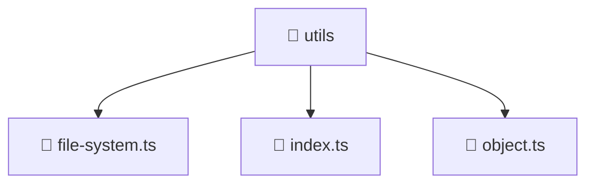

# 📁 utils

[Root](/.) > [backend](/backend) > [src](/backend/src) > [common](/backend/src/common) > [utils](/backend/src/common/utils)

## 🎯 Purpose
Delivering luxury-tier architectural components and high-performance logic for the **utils** domain. This directory is a crucial part of the Mavluda Beauty full-stack ecosystem, ensuring seamless scalability, robust performance, and an elite digital experience.

## 🏗️ Architecture


## 📄 File Registry
| File Name | Type | Responsibility | Key Aliases Used |
|---|---|---|---|
| `file-system.ts` | TypeScript | Handles logic and definitions for file-system.ts | None |
| `index.ts` | TypeScript | Handles logic and definitions for index.ts | None |
| `object.ts` | TypeScript | Handles logic and definitions for object.ts | None |

## 🔗 Dependencies
- `fs`
- `path`
- `util`

## 🛠️ Usage
```typescript
// Example usage within the Mavluda Beauty ecosystem
import { relevantMember } from './utils';

// Integrate into the application architecture
relevantMember.execute();
```
