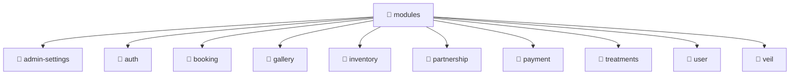

# 📁 modules

[Root](/.) > [backend](/backend) > [src](/backend/src) > [modules](/backend/src/modules)

## 🎯 Purpose
Delivering luxury-tier architectural components and high-performance logic for the **modules** domain. This directory is a crucial part of the Mavluda Beauty full-stack ecosystem, ensuring seamless scalability, robust performance, and an elite digital experience.

## 🏗️ Architecture


## 📄 File Registry
*No relevant files in this directory.*

## 🔗 Dependencies
- No external dependencies.

## 🛠️ Usage
```typescript
// Example usage within the Mavluda Beauty ecosystem
import { relevantMember } from './modules';

// Integrate into the application architecture
relevantMember.execute();
```
