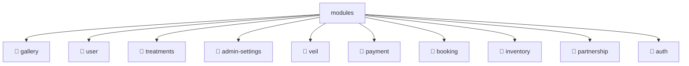

# 📂 MODULES

> 💎 **Mavluda Beauty - Luxury Professional Architecture**

### 📍 Breadcrumb Navigation
`. > backend > src > modules`

## 🎯 PURPOSE
This directory encapsulates `Backend Core/Infrastructure` level functionality within the Mavluda Beauty ecosystem, ensuring proper separation of concerns and architectural transparency.

**FSD / Architecture Layer:** `Backend Core/Infrastructure`

## 🏗️ ARCHITECTURE


## 📄 FILE REGISTRY

| Item Name | Type | Responsibility | Key Aliases Used |
|-----------|------|----------------|------------------|
| `📁 gallery` | `Directory` | Subdirectory logic grouping | `None` |
| `📁 user` | `Directory` | Subdirectory logic grouping | `None` |
| `📁 treatments` | `Directory` | Subdirectory logic grouping | `None` |
| `📁 admin-settings` | `Directory` | Subdirectory logic grouping | `None` |
| `📁 veil` | `Directory` | Subdirectory logic grouping | `None` |
| `📁 payment` | `Directory` | Subdirectory logic grouping | `None` |
| `📁 booking` | `Directory` | Subdirectory logic grouping | `None` |
| `📁 inventory` | `Directory` | Subdirectory logic grouping | `None` |
| `📁 partnership` | `Directory` | Subdirectory logic grouping | `None` |
| `📁 auth` | `Directory` | Subdirectory logic grouping | `None` |

## 🔗 DEPENDENCIES
No external/internal aliases used directly in these files.

## 🛠️ USAGE
```typescript
// Example usage context
// This directory groups child modules/layers. Navigate into subdirectories for specific logic.
```
