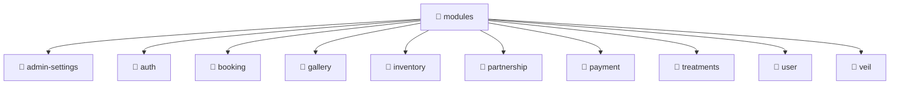

# 📁 Mavluda Beauty modules

[backend](/backend) / [src](/backend/src) / [modules](/backend/src/modules)

## 🎯 Purpose
Delivering luxury-tier architectural components and high-performance logic for the **modules** domain. This directory is a crucial part of the Mavluda Beauty full-stack ecosystem, ensuring seamless scalability, robust performance, and an elite digital experience.

## 🏗️ Architecture


## 📄 File Registry
| File Name | Type | Responsibility | Key Aliases Used |
|---|---|---|---|
| *No files in this directory* | - | - | - |


## 🔗 Dependencies
No external or alias dependencies detected.

## 🛠️ Usage
```typescript
// Example integration for modules
// Import capabilities from this directory to enrich your modules.
```
> This directory provides specialized logic tailored to the Mavluda Beauty standard.
