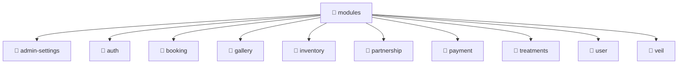

# 📁 modules

[Root](/.) > [backend](/backend) > [src](/backend/src) > [modules](/backend/src/modules)

## 🎯 Purpose
Backend module defining application routes, business logic, and data access for the domain.

## 🏗️ Architecture

## 📄 File Registry
| File Name | Type | Responsibility | Key Aliases Used |
|---|---|---|---|

## 🔗 Dependencies
- No external dependencies.

## 🛠️ Usage
> To interact with its contents, import the relevant exported members.
