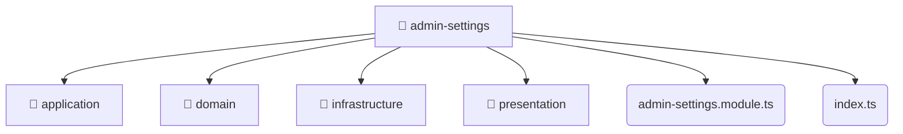

# [root](/) / [backend](/backend) / [src](/backend/src) / [modules](/backend/src/modules) / [admin-settings](/backend/src/modules/admin-settings)

## 🏷️ 📁 Admin-settings

### 🎯 PURPOSE
The `admin-settings` backend module encapsulates the business logic, presentation, and data access for admin-settings.

### 🏗️ ARCHITECTURE


### 📄 FILE REGISTRY
| File Name | Type | Responsibility | Key Aliases Used |
|---|---|---|---|
| `admin-settings.module.ts` | `ts` | Module configuration and provider registration. | @nestjs |
| `index.ts` | `ts` | Core logic implementation. | None |

### 🔗 DEPENDENCIES
- `./admin-settings.module`
- `./application/admin-settings.service`
- `./domain/admin-settings.entity`
- `./infrastructure/repositories/admin-settings.repository`
- `./infrastructure/schemas/admin-settings.schema`
- `./presentation/admin-settings.controller`
- `./presentation/dto/create-admin-settings.dto`
- `./presentation/dto/update-admin-settings.dto`
- `@nestjs/common`
- `@nestjs/mongoose`

### 🛠️ USAGE
```typescript
// Seamlessly integrate admin-settings into your refined workflows:
import { /* exported members */ } from '@path/to/admin-settings';
```
