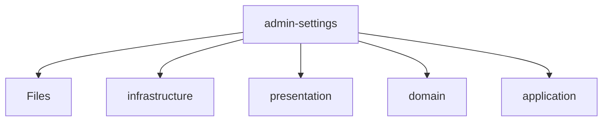

# 📁 Admin-Settings Directory

[backend](/backend) > [src](/backend/src) > [modules](/backend/src/modules) > [admin-settings](/backend/src/modules/admin-settings)

## 🎯 Purpose
A high-level module handling `admin-settings` logic within the Mavluda Beauty ecosystem. This directory adheres to our "Luxury Professional" architectural standards.


## 🏗️ Architecture



## 📄 File Registry
| File Name | Type | Responsibility | Key Aliases Used |
|-----------|------|----------------|------------------|
| `admin-settings.module.ts` | Module | Provides localized module definitions. | @nestjs/common, @nestjs/mongoose |
| `index.ts` | TypeScript | Provides localized typescript definitions. | None |

## 🔗 Dependencies
- `@nestjs/common`
- `@nestjs/mongoose`

## 🛠️ Usage
```typescript
// Architectural overview snippet
import { InternalLogic } from './internal-file';
// Ensure adherence to Hexagonal / FSD principles
```
