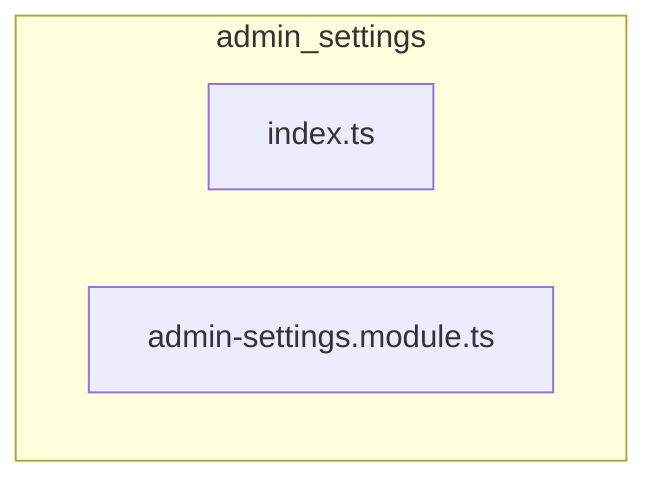

# 📁 admin-settings

[backend](../../../README.md) > [src](../../README.md) > [modules](../README.md) > [admin-settings](README.md)

---

### 🎯 PURPOSE
Elevating the digital experience for the Mavluda Beauty ecosystem, this module manages the sophisticated Feature Module Layer (Bounded Contexts) operations.

*FSD Layer:* **Feature Module Layer (Bounded Contexts)**

---

### 🏗️ ARCHITECTURE



---

### 📄 FILE REGISTRY
| File Name | Type | Responsibility | Key Aliases Used |
|-----------|------|----------------|------------------|
| `index.ts` | Source | Handles source logic for Mavluda Beauty's luxury standards. | `None` |
| `admin-settings.module.ts` | Module | Handles module logic for Mavluda Beauty's luxury standards. | `@nestjs` |

---

### 🔗 DEPENDENCIES
**Key Path Aliases Detected:** `@nestjs`

Notable imports:
- `./domain/admin-settings.entity`
- `./infrastructure/repositories/admin-settings.repository`
- `./presentation/dto/create-admin-settings.dto`
- `./admin-settings.module`
- `./presentation/admin-settings.controller`
- `@nestjs/common`
- `./application/admin-settings.service`
- `./presentation/dto/update-admin-settings.dto`
- `./infrastructure/schemas/admin-settings.schema`
- `@nestjs/mongoose`

---

### 🛠️ USAGE
To interact with this directory's luxurious logic, integrate its exported components or services directly into your feature modules. Ensure strict adherence to the Feature Module Layer (Bounded Contexts) boundaries.

```typescript
// Example integration snippet
import { FeatureModule } from '@path/to/admin-settings';
```
