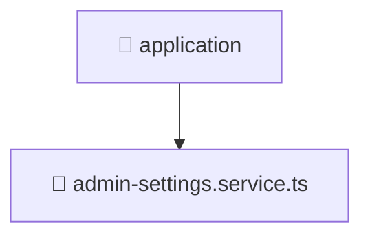

[Root](/.) > [backend](/backend) > [src](/backend/src) > [modules](/backend/src/modules) > [admin-settings](/backend/src/modules/admin-settings) > [application](/backend/src/modules/admin-settings/application)

# 📁 Application (App Layer)

## 🎯 Purpose
Delivering luxury-tier architectural components and high-performance logic for the **application** domain. This directory is a crucial part of the Mavluda Beauty full-stack ecosystem, ensuring seamless scalability, robust performance, and an elite digital experience.
This directory operates within the **App Layer** of the Feature Sliced Design (FSD) architecture.

## 🏗️ Architecture


## 📄 File Registry
| File Name | Type | Responsibility | Key Aliases Used |
|---|---|---|---|
| `admin-settings.service.ts` | TypeScript | Encapsulates business logic and data access for admin-settings.service.ts. | @nestjs |

## 🔗 Dependencies
- `../domain/admin-settings.entity`, `../infrastructure/repositories/admin-settings.repository`, `@nestjs/common`

## 🛠️ Usage
```typescript
// Example usage within the Mavluda Beauty ecosystem
import { relevantMember } from './core';

// Integrate into the application architecture
relevantMember.execute();
```