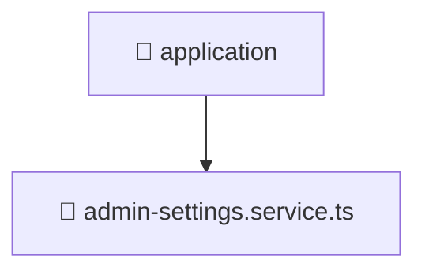

# 📁 application

[Root](/.) > [backend](/backend) > [src](/backend/src) > [modules](/backend/src/modules) > [admin-settings](/backend/src/modules/admin-settings) > [application](/backend/src/modules/admin-settings/application)

## 🎯 Purpose
Backend module defining application routes, business logic, and data access for the domain.

## 🏗️ Architecture


## 📄 File Registry
| File Name | Type | Responsibility | Key Aliases Used |
|---|---|---|---|
| `admin-settings.service.ts` | TypeScript | Encapsulates business logic and data access for admin-settings.service.ts. | @nestjs |

## 🔗 Dependencies
- `../domain/admin-settings.entity`
- `../infrastructure/repositories/admin-settings.repository`
- `@nestjs/common`

## 🛠️ Usage
```typescript
import { Module } from '@nestjs/common';
// Import specific services/controllers provided by this module
```
