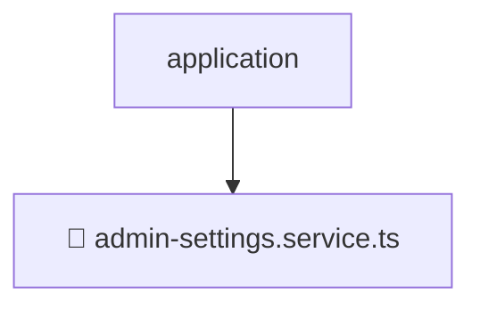

# 📂 APPLICATION

> 💎 **Mavluda Beauty - Luxury Professional Architecture**

### 📍 Breadcrumb Navigation
`. > backend > src > modules > admin-settings > application`

## 🎯 PURPOSE
This directory encapsulates `App` level functionality within the Mavluda Beauty ecosystem, ensuring proper separation of concerns and architectural transparency.

**FSD / Architecture Layer:** `App`

## 🏗️ ARCHITECTURE


## 📄 FILE REGISTRY

| Item Name | Type | Responsibility | Key Aliases Used |
|-----------|------|----------------|------------------|
| `📄 admin-settings.service.ts` | `.ts` | Service logic | `@nestjs/common` |

## 🔗 DEPENDENCIES
- `@nestjs/common`

## 🛠️ USAGE
```typescript
// Example usage context
import { ... } from './admin-settings.service';

// Integrate admin-settings.service logic into your feature.
```
