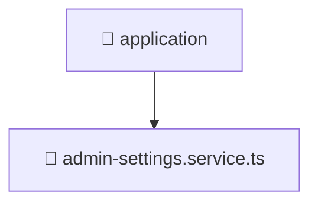

# 📁 application

[Root](/.) > [backend](/backend) > [src](/backend/src) > [modules](/backend/src/modules) > [admin-settings](/backend/src/modules/admin-settings) > [application](/backend/src/modules/admin-settings/application)

## 🎯 Purpose
Delivering luxury-tier architectural components and high-performance logic for the **application** domain. This directory is a crucial part of the Mavluda Beauty full-stack ecosystem, ensuring seamless scalability, robust performance, and an elite digital experience.
> **FSD Layer:** Modules (Backend FSD) - Adhering to strict Feature Sliced Design architectural constraints.

## 🏗️ Architecture


## 📄 File Registry
| File Name | Type | Responsibility | Key Aliases Used |
|---|---|---|---|
| `admin-settings.service.ts` | Service | Business logic and state management. | @nestjs |


## 🔗 Dependencies
- `@nestjs/common`
- `../domain/admin-settings.entity`
- `../infrastructure/repositories/admin-settings.repository`

## 🛠️ Usage
```typescript
// Example usage within the Mavluda Beauty ecosystem
import { relevantMember } from './admin-settings.service';

// Integrate into the application architecture
relevantMember.execute();
```
