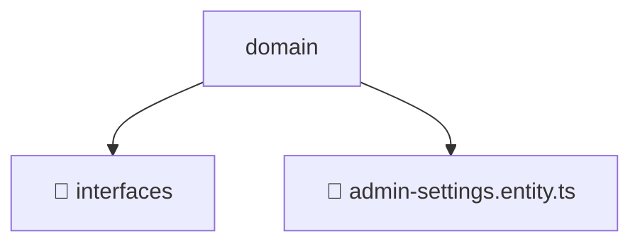

# 📂 DOMAIN

> 💎 **Mavluda Beauty - Luxury Professional Architecture**

### 📍 Breadcrumb Navigation
`. > backend > src > modules > admin-settings > domain`

## 🎯 PURPOSE
This directory encapsulates `Domain` level functionality within the Mavluda Beauty ecosystem, ensuring proper separation of concerns and architectural transparency.

**FSD / Architecture Layer:** `Domain`

## 🏗️ ARCHITECTURE


## 📄 FILE REGISTRY

| Item Name | Type | Responsibility | Key Aliases Used |
|-----------|------|----------------|------------------|
| `📁 interfaces` | `Directory` | Subdirectory logic grouping | `None` |
| `📄 admin-settings.entity.ts` | `.ts` | General functionality | `None` |

## 🔗 DEPENDENCIES
No external/internal aliases used directly in these files.

## 🛠️ USAGE
```typescript
// Example usage context
import { ... } from './admin-settings.entity';

// Integrate admin-settings.entity logic into your feature.
```
