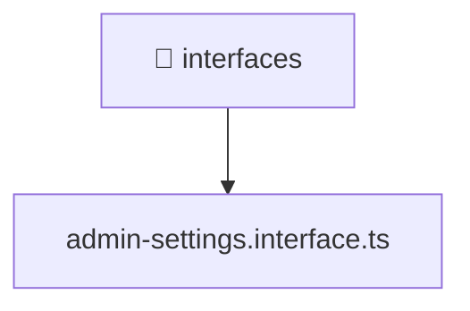

[🏠 Home](../../../../../../README.md) > [backend](../../../../../README.md) > [src](../../../../README.md) > [modules](../../../README.md) > [admin-settings](../../README.md) > [domain](../README.md) > [interfaces](./README.md)

# 📁 interfaces

### 🎯 PURPOSE
Welcome to the exquisite **interfaces** module of the Mavluda Beauty ecosystem. This directory handles specific domain assets and logic. It is designed adhering to our 'Luxury Professional' standards.

### 🏗️ ARCHITECTURE


### 📄 FILE REGISTRY
| File Name | Type | Responsibility | Key Aliases Used |
|---|---|---|---|
| `admin-settings.interface.ts` | TypeScript File | Defines interfaces/types: IAdminLocation, IOwnerInfo, IAdminSettings. | None |

### 🔗 DEPENDENCIES
No notable dependencies detected.

### 🛠️ USAGE
```typescript
// Example interaction or integration snippet
// Import members from interfaces based on module boundaries
```
