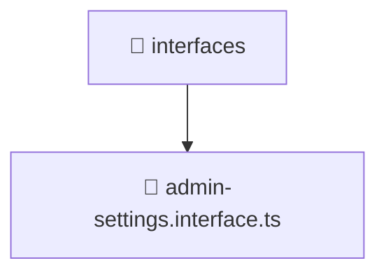

# 📁 interfaces

[Root](/../../../../../../README.md) / [backend](../../../../../README.md) / [src](../../../../README.md) / [modules](../../../README.md) / [admin-settings](../../README.md) / [domain](../README.md) / [interfaces](./README.md)

## 🎯 Purpose
Delivering luxury-tier architectural components and high-performance logic for the **interfaces** domain. This directory is a crucial part of the Mavluda Beauty full-stack ecosystem, ensuring seamless scalability, robust performance, and an elite digital experience.

## 🏗️ Architecture


## 📄 File Registry
| File Name | Type | Responsibility | Key Aliases Used |
|---|---|---|---|
| `admin-settings.interface.ts` | TypeScript | Provides core logic and orchestration for admin-settings.interface.ts. | N/A |


## 🔗 Dependencies
- No external dependencies.

## 🛠️ Usage
```typescript
// Example usage within the Mavluda Beauty ecosystem
import { relevantMember } from './admin-settings.interface';

// Integrate into the application architecture
relevantMember.execute();
```
