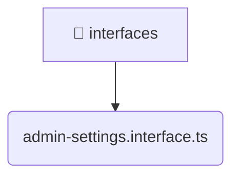

# [root](/) / [backend](/backend) / [src](/backend/src) / [modules](/backend/src/modules) / [admin-settings](/backend/src/modules/admin-settings) / [domain](/backend/src/modules/admin-settings/domain) / [interfaces](/backend/src/modules/admin-settings/domain/interfaces)

## 🏷️ 📁 Interfaces

### 🎯 PURPOSE
The `interfaces` backend module encapsulates the business logic, presentation, and data access for interfaces.

### 🏗️ ARCHITECTURE


### 📄 FILE REGISTRY
| File Name | Type | Responsibility | Key Aliases Used |
|---|---|---|---|
| `admin-settings.interface.ts` | `ts` | Core logic implementation. | None |

### 🔗 DEPENDENCIES
- `None`

### 🛠️ USAGE
```typescript
// Seamlessly integrate interfaces into your refined workflows:
import { /* exported members */ } from '@path/to/interfaces';
```
