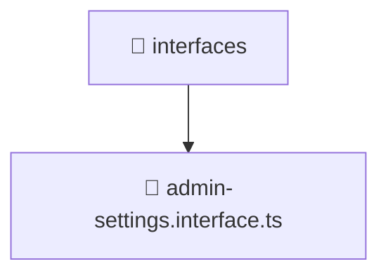

# 📁 Mavluda Beauty interfaces

[backend](/backend) / [src](/backend/src) / [modules](/backend/src/modules) / [admin-settings](/backend/src/modules/admin-settings) / [domain](/backend/src/modules/admin-settings/domain) / [interfaces](/backend/src/modules/admin-settings/domain/interfaces)

## 🎯 Purpose
Delivering luxury-tier architectural components and high-performance logic for the **interfaces** domain. This directory is a crucial part of the Mavluda Beauty full-stack ecosystem, ensuring seamless scalability, robust performance, and an elite digital experience.

## 🏗️ Architecture


## 📄 File Registry
| File Name | Type | Responsibility | Key Aliases Used |
|---|---|---|---|
| `admin-settings.interface.ts` | TypeScript Logic | Core logic and utilities for this domain. | N/A |


## 🔗 Dependencies
No external or alias dependencies detected.

## 🛠️ Usage
```typescript
// Example integration for interfaces
// Import capabilities from this directory to enrich your modules.
```
> This directory provides specialized logic tailored to the Mavluda Beauty standard.
