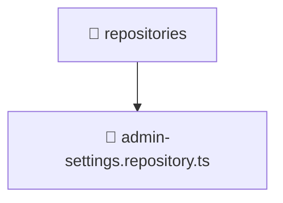

# 📁 Mavluda Beauty repositories

[backend](/backend) / [src](/backend/src) / [modules](/backend/src/modules) / [admin-settings](/backend/src/modules/admin-settings) / [infrastructure](/backend/src/modules/admin-settings/infrastructure) / [repositories](/backend/src/modules/admin-settings/infrastructure/repositories)

## 🎯 Purpose
Delivering luxury-tier architectural components and high-performance logic for the **repositories** domain. This directory is a crucial part of the Mavluda Beauty full-stack ecosystem, ensuring seamless scalability, robust performance, and an elite digital experience.

## 🏗️ Architecture


## 📄 File Registry
| File Name | Type | Responsibility | Key Aliases Used |
|---|---|---|---|
| `admin-settings.repository.ts` | TypeScript Logic | Core logic and utilities for this domain. | `@nestjs/common, @nestjs/mongoose` |


## 🔗 Dependencies
**Path Aliases:**
- `@nestjs/common`
- `@nestjs/mongoose`

**External Packages:**
- `mongoose`


## 🛠️ Usage
```typescript
// Example integration for repositories
// Import capabilities from this directory to enrich your modules.
```
> This directory provides specialized logic tailored to the Mavluda Beauty standard.
