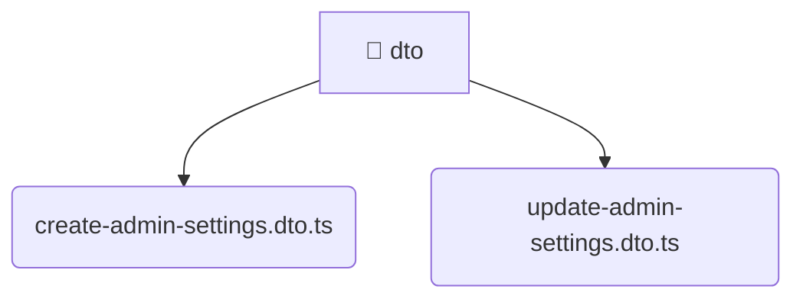

# [root](/) / [backend](/backend) / [src](/backend/src) / [modules](/backend/src/modules) / [admin-settings](/backend/src/modules/admin-settings) / [presentation](/backend/src/modules/admin-settings/presentation) / [dto](/backend/src/modules/admin-settings/presentation/dto)

## 🏷️ 📁 Dto

### 🎯 PURPOSE
The `dto` directory forms a critical foundation within the Mavluda Beauty ecosystem, meticulously orchestrating the dto logic to ensure a seamless and premium experience.

### 🏗️ ARCHITECTURE


### 📄 FILE REGISTRY
| File Name | Type | Responsibility | Key Aliases Used |
|---|---|---|---|
| `create-admin-settings.dto.ts` | `ts` | Data transfer objects and models. | None |
| `update-admin-settings.dto.ts` | `ts` | Data transfer objects and models. | @nestjs |

### 🔗 DEPENDENCIES
- `../../domain/interfaces/admin-settings.interface`
- `./create-admin-settings.dto`
- `@nestjs/mapped-types`
- `class-transformer`
- `class-validator`

### 🛠️ USAGE
```typescript
// Seamlessly integrate dto into your refined workflows:
import { /* exported members */ } from '@path/to/dto';
```
