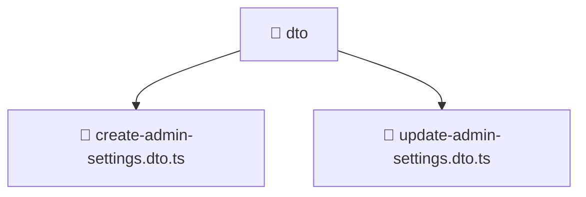

# 📁 dto

[Root](/.) > [backend](/backend) > [src](/backend/src) > [modules](/backend/src/modules) > [admin-settings](/backend/src/modules/admin-settings) > [presentation](/backend/src/modules/admin-settings/presentation) > [dto](/backend/src/modules/admin-settings/presentation/dto)

## 🎯 Purpose
Delivering luxury-tier architectural components and high-performance logic for the **dto** domain. This directory is a crucial part of the Mavluda Beauty full-stack ecosystem, ensuring seamless scalability, robust performance, and an elite digital experience.
> **FSD Layer:** Modules (Backend FSD) - Adhering to strict Feature Sliced Design architectural constraints.

## 🏗️ Architecture


## 📄 File Registry
| File Name | Type | Responsibility | Key Aliases Used |
|---|---|---|---|
| `create-admin-settings.dto.ts` | DTO | Data Transfer Object for validation. | N/A |
| `update-admin-settings.dto.ts` | DTO | Data Transfer Object for validation. | @nestjs |


## 🔗 Dependencies
- `class-transformer`
- `class-validator`
- `../../domain/interfaces/admin-settings.interface`
- `@nestjs/mapped-types`
- `./create-admin-settings.dto`

## 🛠️ Usage
```typescript
// Example usage within the Mavluda Beauty ecosystem
import { relevantMember } from './create-admin-settings.dto';

// Integrate into the application architecture
relevantMember.execute();
```
