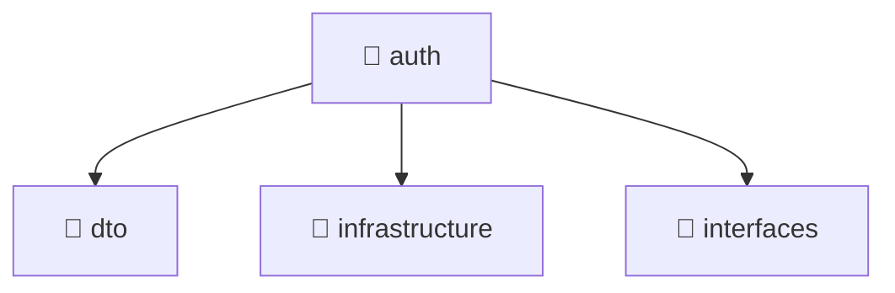

# 📁 auth

[Root](/.) / [backend](../../..) / [src](../..) / [modules](..) / [auth](.)

## 🎯 Purpose
Delivering luxury-tier architectural components and high-performance logic for the **auth** domain. This directory orchestrates precise operations within the Mavluda Beauty ecosystem, maintaining our elite standards of digital excellence.

## 🏗️ Architecture


## 📄 File Registry
| File Name | Type | Responsibility | Key Aliases Used |
|---|---|---|---|
| `auth.controller.ts` | TypeScript | API routing and request handling. | @nestjs, @common |
| `auth.module.ts` | TypeScript | Dependency injection and module orchestration. | @nestjs, @modules, @common |
| `auth.service.ts` | TypeScript | Business logic execution and state management. | @nestjs, @modules |
| `index.ts` | TypeScript | Core logic and utilities for this domain. | N/A |
| `telegram-auth.service.ts` | TypeScript | Business logic execution and state management. | @nestjs, @common, @modules |

## 🔗 Dependencies
- `@nestjs`
- `@common`
- `@modules`

## 🛠️ Usage
```markdown
> This directory acts primarily as a structural container or logic module.
> To interact with its contents, import the relevant exported members from the `index.ts` or specifically targeted files.
```
