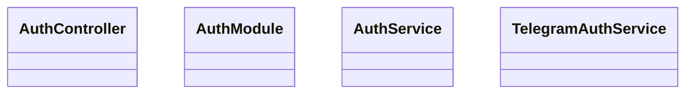

# 📁 Auth Directory

[Root](/.) / [backend](/backend) / [src](/backend/src) / [modules](/backend/src/modules) / [auth](/backend/src/modules/auth)

## 🎯 Purpose
Delivering luxury-tier architectural components and high-performance logic for the **auth** domain. This directory is a crucial part of the Mavluda Beauty full-stack ecosystem, ensuring seamless scalability, robust performance, and an elite digital experience.

## 🏗️ Architecture


## 📄 File Registry
| File Name | Type | Responsibility | Key Aliases Used |
|---|---|---|---|
| `auth.controller.ts` | File | Handles incoming HTTP requests and routing for auth.controller.ts. | @nestjs/common |
| `auth.module.ts` | File | Defines the architectural module boundaries for auth.module.ts. | @modules/user, @nestjs/passport, @nestjs/jwt, @nestjs/common |
| `auth.service.ts` | File | Encapsulates business logic and data access for auth.service.ts. | @modules/user, @nestjs/jwt, @nestjs/common |
| `dto` | Directory | Contains architectural sub-modules and layer logic for dto. | N/A |
| `index.ts` | File | Provides core logic and orchestration for index.ts. | N/A |
| `infrastructure` | Directory | Contains architectural sub-modules and layer logic for infrastructure. | N/A |
| `interfaces` | Directory | Contains architectural sub-modules and layer logic for interfaces. | N/A |
| `telegram-auth.service.ts` | File | Encapsulates business logic and data access for telegram-auth.service.ts. | @modules/user, @nestjs/common |

## 🔗 Dependencies
- Relies on internal Mavluda Beauty architecture and designated FSD layers.
- See 'Key Aliases Used' in the File Registry for explicit cross-domain references.

## 🛠️ Usage
```typescript
// Example usage within the Mavluda Beauty ecosystem
import { relevantMember } from './core';

// Integrate into the application architecture
relevantMember.execute();
```
