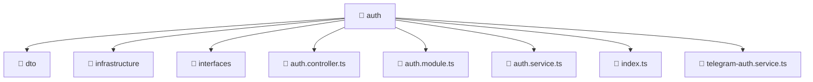

# 📁 Auth

[Root](../../../../) > [backend](../../../) > [src](../../) > [modules](../) > [auth](./)

## 🎯 Purpose
Delivering luxury-tier architectural components and high-performance logic for the **Auth** domain. This directory is a crucial part of the Mavluda Beauty full-stack ecosystem, ensuring seamless scalability, robust performance, and an elite digital experience.

**Architecture Layer:** Backend Infrastructure (Feature Sliced Design / Layered Architecture)

## 🏗️ Architecture


## 📄 File Registry
| File Name | Type | Responsibility | Key Aliases Used |
|---|---|---|---|
| `auth.controller.ts` | TypeScript | Core logic and utilities for this domain. | @nestjs/common |
| `auth.module.ts` | TypeScript | Core logic and utilities for this domain. | @nestjs/jwt, @nestjs/passport, @nestjs/common, @modules/user |
| `auth.service.ts` | TypeScript | Core logic and utilities for this domain. | @nestjs/jwt, @nestjs/common, @modules/user |
| `index.ts` | TypeScript | Core logic and utilities for this domain. | N/A |
| `telegram-auth.service.ts` | TypeScript | Core logic and utilities for this domain. | @nestjs/common, @modules/user |


## 🔗 Dependencies
- `@modules/user`
- `@nestjs/common`
- `@nestjs/jwt`
- `@nestjs/passport`

## 🛠️ Usage
```markdown
> This directory acts primarily as a structural container or logic module.
> To interact with its contents, import the relevant exported members from the `index.ts` or specifically targeted files.
```
