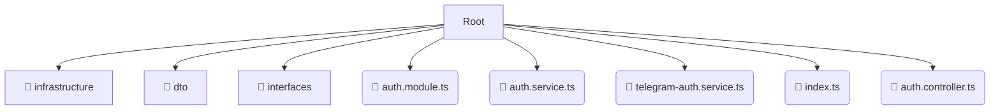

# 📂 auth

*Breadcrumbs:* [backend](/backend) / [src](/backend/src) / [modules](/backend/src/modules) / [auth](/backend/src/modules/auth)

## 🎯 PURPOSE
This directory `auth` is an integral part of the Mavluda Beauty ecosystem. It supports the scalable NestJS backend architecture.
This directory is meticulously maintained to uphold the 'Luxury Professional' standards of the Mavluda Beauty brand.

## 🏗️ ARCHITECTURE


## 📄 FILE REGISTRY
| File Name | Type | Responsibility | Key Aliases Used |
|---|---|---|---|
| `auth.module.ts` | `ts` | Module configuration | `@nestjs/common, @nestjs/jwt, @common/config/app-config.service...` |
| `auth.service.ts` | `ts` | Core functionality | `@nestjs/common, @modules/user, @nestjs/jwt` |
| `telegram-auth.service.ts` | `ts` | Core functionality | `@nestjs/common, @common/config/app-config.service, @modules/user` |
| `index.ts` | `ts` | Core functionality | `None` |
| `auth.controller.ts` | `ts` | Core functionality | `@nestjs/common, @common/decorators/public.decorator` |

## 🔗 DEPENDENCIES
- `@nestjs/common`
- `@nestjs/jwt`
- `@common/config/app-config.service`
- `@common/config/app-config.module`
- `@nestjs/passport`
- `@modules/user`
- `@common/decorators/public.decorator`

## 🛠️ USAGE
```typescript
// Example placeholder for interacting with the auth module
import { example } from './auth.module.ts';
```
