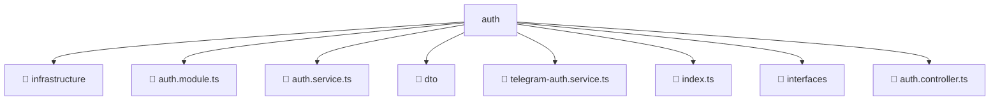

# 📂 AUTH

> 💎 **Mavluda Beauty - Luxury Professional Architecture**

### 📍 Breadcrumb Navigation
`. > backend > src > modules > auth`

## 🎯 PURPOSE
This directory encapsulates `Module Root` level functionality within the Mavluda Beauty ecosystem, ensuring proper separation of concerns and architectural transparency.

**FSD / Architecture Layer:** `Module Root`

## 🏗️ ARCHITECTURE


## 📄 FILE REGISTRY

| Item Name | Type | Responsibility | Key Aliases Used |
|-----------|------|----------------|------------------|
| `📁 infrastructure` | `Directory` | Subdirectory logic grouping | `None` |
| `📄 auth.module.ts` | `.ts` | Module configuration | `@common/config/app-config.service, @modules/user, @nestjs/common, @nestjs/passport, @common/config/app-config.module, @nestjs/jwt` |
| `📄 auth.service.ts` | `.ts` | Service logic | `@modules/user, @nestjs/common, @nestjs/jwt` |
| `📁 dto` | `Directory` | Subdirectory logic grouping | `None` |
| `📄 telegram-auth.service.ts` | `.ts` | Service logic | `@common/config/app-config.service, @nestjs/common, @modules/user` |
| `📄 index.ts` | `.ts` | General functionality | `None` |
| `📁 interfaces` | `Directory` | Subdirectory logic grouping | `None` |
| `📄 auth.controller.ts` | `.ts` | Controller logic | `@common/decorators/public.decorator, @nestjs/common` |

## 🔗 DEPENDENCIES
- `@common/config/app-config.service`
- `@common/decorators/public.decorator`
- `@modules/user`
- `@nestjs/common`
- `@nestjs/passport`
- `@common/config/app-config.module`
- `@nestjs/jwt`

## 🛠️ USAGE
```typescript
// Example usage context
import { ... } from './auth.module';

// Integrate auth.module logic into your feature.
```
