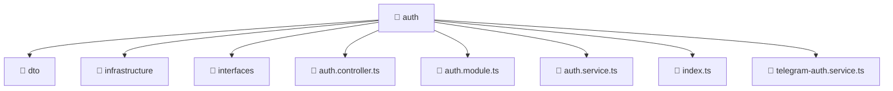

<!--
Mavluda Beauty - Luxury Professional Documentation
Generated for 100% Architectural Transparency
-->
[Home](../../../../README.md) > [backend](../../../README.md) > [src](../../README.md) > [modules](../README.md) > [auth](./README.md)

# 🔐 AUTH Directory

## 🎯 PURPOSE
Manages the auth module, providing robust and secure backend services for the Mavluda Beauty application.

## 🏗️ ARCHITECTURE


## 📄 FILE REGISTRY
| File Name | Type | Responsibility | Key Aliases Used |
|---|---|---|---|
| `auth.controller.ts` | TypeScript | Request routing and response handling. | @nestjs, @common |
| `auth.module.ts` | TypeScript | Module configuration and dependency injection. | @nestjs, @modules, @common |
| `auth.service.ts` | TypeScript | Business logic and service orchestration. | @modules, @nestjs |
| `index.ts` | TypeScript | Core logic implementation. | - |
| `telegram-auth.service.ts` | TypeScript | Business logic and service orchestration. | @nestjs, @common, @modules |


## 🔗 DEPENDENCIES
- `@nestjs/common`
- `./telegram-auth.service`
- `./auth.service`
- `./dto/login.dto`
- `./dto/register.dto`
- `@common/decorators/public.decorator`
- `./auth.controller`
- `@modules/user`
- `@nestjs/passport`
- `@nestjs/jwt`
- `@common/config/app-config.module`
- `@common/config/app-config.service`
- `./infrastructure/jwt.strategy`
- `bcrypt`
- `./interfaces/auth-response.interface`
- `crypto`

## 🛠️ USAGE
```typescript
// Example placeholder for interacting with auth
// Consult the individual files in the registry for specific APIs.
```
