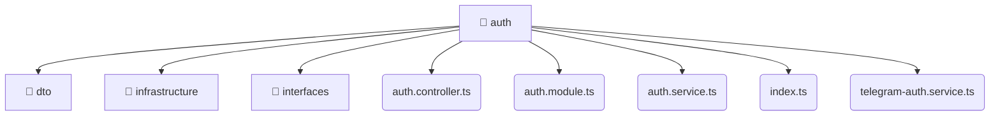

# [root](/) / [backend](/backend) / [src](/backend/src) / [modules](/backend/src/modules) / [auth](/backend/src/modules/auth)

## 🏷️ 📁 Auth

### 🎯 PURPOSE
The `auth` directory forms a critical foundation within the Mavluda Beauty ecosystem, meticulously orchestrating the auth logic to ensure a seamless and premium experience.

### 🏗️ ARCHITECTURE


### 📄 FILE REGISTRY
| File Name | Type | Responsibility | Key Aliases Used |
|---|---|---|---|
| `auth.controller.ts` | `ts` | Handles incoming HTTP requests. | @nestjs, @common |
| `auth.module.ts` | `ts` | Module configuration and provider registration. | @modules, @nestjs, @common |
| `auth.service.ts` | `ts` | Business logic and service layer. | @modules, @nestjs |
| `index.ts` | `ts` | Core logic implementation. | None |
| `telegram-auth.service.ts` | `ts` | Business logic and service layer. | @modules, @nestjs, @common |

### 🔗 DEPENDENCIES
- `./auth.controller`
- `./auth.module`
- `./auth.service`
- `./dto/login.dto`
- `./dto/register.dto`
- `./infrastructure/jwt.strategy`
- `./interfaces/auth-response.interface`
- `./interfaces/jwt-payload.interface`
- `./telegram-auth.service`
- `@common/config/app-config.module`
- *...and more.*

### 🛠️ USAGE
```typescript
// Seamlessly integrate auth into your refined workflows:
import { /* exported members */ } from '@path/to/auth';
```
