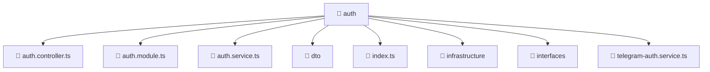

# 📁 auth

[Root](/.) > [backend](/backend) > [src](/backend/src) > [modules](/backend/src/modules) > [auth](/backend/src/modules/auth)

## 🎯 Purpose
Delivering luxury-tier architectural components and high-performance logic for the **auth** domain. This directory is a crucial part of the Mavluda Beauty full-stack ecosystem, ensuring seamless scalability, robust performance, and an elite digital experience.

## 🏗️ Architecture


## 📄 File Registry
| File Name | Type | Responsibility | Key Aliases Used |
|---|---|---|---|
| `auth.controller.ts` | TypeScript | Handles incoming requests and routing for auth | @common/decorators/public.decorator |
| `auth.module.ts` | TypeScript | Defines module boundaries for auth | @common/config/app-config.module, @common/config/app-config.service, @modules/user, @nestjs/common, @nestjs/jwt, @nestjs/passport |
| `auth.service.ts` | TypeScript | Encapsulates business logic for auth | @modules/user, @nestjs/jwt |
| `index.ts` | TypeScript | Handles logic and definitions for index.ts | None |
| `telegram-auth.service.ts` | TypeScript | Encapsulates business logic for telegram-auth | @common/config/app-config.service, @modules/user, @nestjs/common |

## 🔗 Dependencies
- `./auth.controller`
- `./auth.service`
- `./dto/login.dto`
- `./dto/register.dto`
- `./infrastructure/jwt.strategy`
- `./interfaces/auth-response.interface`
- `./telegram-auth.service`
- `@common/config/app-config.module`
- `@common/config/app-config.service`
- `@common/decorators/public.decorator`
- `@modules/user`
- `@nestjs/common`
- `@nestjs/jwt`
- `@nestjs/passport`
- `bcrypt`
- `crypto`

## 🛠️ Usage
```typescript
// Example usage within the Mavluda Beauty ecosystem
import { relevantMember } from './auth';

// Integrate into the application architecture
relevantMember.execute();
```
