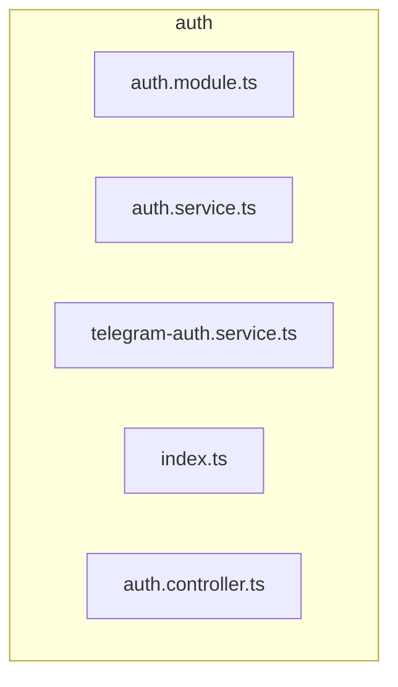

# 📁 auth

[backend](../../../README.md) > [src](../../README.md) > [modules](../README.md) > [auth](README.md)

---

### 🎯 PURPOSE
Elevating the digital experience for the Mavluda Beauty ecosystem, this module manages the sophisticated Feature Module Layer (Bounded Contexts) operations.

*FSD Layer:* **Feature Module Layer (Bounded Contexts)**

---

### 🏗️ ARCHITECTURE



---

### 📄 FILE REGISTRY
| File Name | Type | Responsibility | Key Aliases Used |
|-----------|------|----------------|------------------|
| `auth.module.ts` | Module | Handles module logic for Mavluda Beauty's luxury standards. | `@modules, @common, @nestjs` |
| `auth.service.ts` | Service | Handles service logic for Mavluda Beauty's luxury standards. | `@modules, @nestjs` |
| `telegram-auth.service.ts` | Service | Handles service logic for Mavluda Beauty's luxury standards. | `@modules, @common, @nestjs` |
| `index.ts` | Source | Handles source logic for Mavluda Beauty's luxury standards. | `None` |
| `auth.controller.ts` | Controller | Handles controller logic for Mavluda Beauty's luxury standards. | `@common, @nestjs` |

---

### 🔗 DEPENDENCIES
**Key Path Aliases Detected:** `@nestjs`, `@modules`, `@common`

Notable imports:
- `./interfaces/jwt-payload.interface`
- `crypto`
- `./auth.service`
- `@modules/user`
- `@nestjs/common`
- `@common/config/app-config.service`
- `@common/config/app-config.module`
- `./auth.module`
- `@nestjs/jwt`
- `./dto/login.dto`
- *...and 8 more*

---

### 🛠️ USAGE
To interact with this directory's luxurious logic, integrate its exported components or services directly into your feature modules. Ensure strict adherence to the Feature Module Layer (Bounded Contexts) boundaries.

```typescript
// Example integration snippet
import { FeatureModule } from '@path/to/auth';
```
