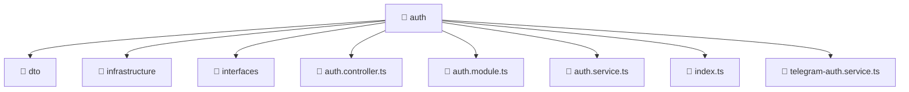

# 📁 auth

[Root](/.) > [backend](/backend) > [src](/backend/src) > [modules](/backend/src/modules) > [auth](/backend/src/modules/auth)

## 🎯 Purpose
Delivering luxury-tier architectural components and high-performance logic for the **Auth** domain. This directory is a crucial part of the Mavluda Beauty full-stack ecosystem, ensuring seamless scalability, robust performance, and an elite digital experience.

**Architecture Layer:** Backend Infrastructure (Feature Sliced Design / Layered Architecture)

## 🏗️ Architecture


## 📄 File Registry
| File Name | Type | Responsibility | Key Aliases Used |
|---|---|---|---|
| `auth.controller.ts` | TypeScript | Core logic and utilities for this domain. | @common |
| `auth.module.ts` | TypeScript | Core logic and utilities for this domain. | @common, @modules, @nestjs |
| `auth.service.ts` | TypeScript | Core logic and utilities for this domain. | @modules, @nestjs |
| `index.ts` | TypeScript | Core logic and utilities for this domain. | N/A |
| `telegram-auth.service.ts` | TypeScript | Core logic and utilities for this domain. | @common, @modules, @nestjs |

## 🔗 Dependencies
- `./auth.controller`
- `./auth.service`
- `./dto/login.dto`
- `./dto/register.dto`
- `./infrastructure/jwt.strategy`
- `./interfaces/auth-response.interface`
- `./telegram-auth.service`
- `@common/config/app-config.module`
- `@common/config/app-config.service`
- `@common/decorators/public.decorator`
- `@modules/user`
- `@nestjs/common`
- `@nestjs/jwt`
- `@nestjs/passport`
- `bcrypt`
- `crypto`

## 🛠️ Usage
```markdown
```markdown
> This directory acts primarily as a structural container or logic module.
> To interact with its contents, import the relevant exported members from the `index.ts` or specifically targeted files.
```
```
