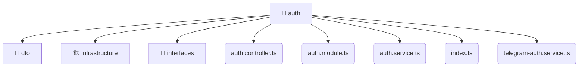

# [backend](/backend) / [src](/backend/src) / [modules](/backend/src/modules) / [auth](/backend/src/modules/auth)

## 🏷️ 📁 Auth

### 🎯 PURPOSE
The `auth` directory forms a critical foundation within the Mavluda Beauty ecosystem, meticulously orchestrating the auth logic to ensure a seamless and premium experience. Rooted in the NestJS backend architecture, it delivers robust, high-performance operations tailored for high-end beauty and wedding services.

### 🏗️ ARCHITECTURE


### 📄 FILE REGISTRY
| File Name | Type | Responsibility | Key Aliases Used |
|---|---|---|---|
| `auth.controller.ts` | `ts` | Encapsulates premium logic and definitions for `auth.controller.ts`. | @common/decorators/public.decorator, @nestjs/common |
| `auth.module.ts` | `ts` | Encapsulates premium logic and definitions for `auth.module.ts`. | @nestjs/jwt, @nestjs/passport, @common/config/app-config.service, @nestjs/common, @modules/user, @common/config/app-config.module |
| `auth.service.ts` | `ts` | Encapsulates premium logic and definitions for `auth.service.ts`. | @nestjs/jwt, @modules/user, @nestjs/common |
| `index.ts` | `ts` | Encapsulates premium logic and definitions for `index.ts`. | None |
| `telegram-auth.service.ts` | `ts` | Encapsulates premium logic and definitions for `telegram-auth.service.ts`. | @common/config/app-config.service, @modules/user, @nestjs/common |


### 🔗 DEPENDENCIES
- `@common/config/app-config.module`
- `@common/config/app-config.service`
- `@common/decorators/public.decorator`
- `@modules/user`
- `@nestjs/common`
- `@nestjs/jwt`
- `@nestjs/passport`

### 🛠️ USAGE
```typescript
// Seamlessly integrate auth into your refined workflows:
import { /* exported members */ } from '@path/to/auth';
```
