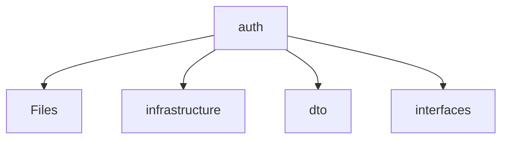

# 📁 Auth Directory

[backend](/backend) > [src](/backend/src) > [modules](/backend/src/modules) > [auth](/backend/src/modules/auth)

## 🎯 Purpose
A high-level module handling `auth` logic within the Mavluda Beauty ecosystem. This directory adheres to our "Luxury Professional" architectural standards.


## 🏗️ Architecture



## 📄 File Registry
| File Name | Type | Responsibility | Key Aliases Used |
|-----------|------|----------------|------------------|
| `auth.controller.ts` | Controller | Handles incoming HTTP requests and routing. | @nestjs/common, @common/decorators/public.decorator |
| `auth.module.ts` | Module | Provides localized module definitions. | @common/config/app-config.module, @common/config/app-config.service, @nestjs/jwt, @nestjs/passport, @modules/user, @nestjs/common |
| `auth.service.ts` | Service | Executes core business logic and use cases. | @nestjs/common, @nestjs/jwt, @modules/user |
| `index.ts` | TypeScript | Provides localized typescript definitions. | None |
| `telegram-auth.service.ts` | Service | Executes core business logic and use cases. | @nestjs/common, @common/config/app-config.service, @modules/user |

## 🔗 Dependencies
- `@common/config/app-config.module`
- `@common/config/app-config.service`
- `@common/decorators/public.decorator`
- `@modules/user`
- `@nestjs/common`
- `@nestjs/jwt`
- `@nestjs/passport`

## 🛠️ Usage
```typescript
// Architectural overview snippet
import { InternalLogic } from './internal-file';
// Ensure adherence to Hexagonal / FSD principles
```
