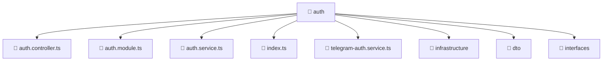

### 🧭 Breadcrumbs
[Root](/) > [backend](/backend) > [src](/backend/src) > [modules](/backend/src/modules) > [auth](/backend/src/modules/auth)

# 📁 Auth Directory
**Architecture Layer:** Domain/Infrastructure Layer

## 🎯 Purpose
Provides luxury professional architectural implementation for the auth module within the Mavluda Beauty ecosystem. Ensure robust functionality and elegant integration with the broader architecture.

## 🏗️ ARCHITECTURE


## 📄 FILE REGISTRY
| File Name | Type | Responsibility | Key Aliases Used |
|---|---|---|---|
| `auth.controller.ts` | TypeScript | Handles incoming HTTP requests and routing for auth.controller.ts. | @nestjs/common, @common/decorators/public.decorator |
| `auth.module.ts` | TypeScript | Defines the architectural module boundaries for auth.module.ts. | @nestjs/common, @nestjs/passport, @modules/user, @common/config/app-config.module, @nestjs/jwt, @common/config/app-config.service |
| `auth.service.ts` | TypeScript | Encapsulates business logic and data access for auth.service.ts. | @nestjs/common, @nestjs/jwt, @common/config/app-config.service, @modules/user |
| `index.ts` | TypeScript | Provides core logic and orchestration for index.ts. | N/A |
| `telegram-auth.service.ts` | TypeScript | Encapsulates business logic and data access for telegram-auth.service.ts. | @nestjs/common, @common/config/app-config.service, @modules/user |

## 🔗 DEPENDENCIES
- `@common/config/app-config.module`
- `@common/config/app-config.service`
- `@common/decorators/public.decorator`
- `@modules/user`
- `@nestjs/common`
- `@nestjs/jwt`
- `@nestjs/passport`

## 🛠️ USAGE
```typescript
// Example architectural integration for auth
// Utilize the exported members according to Mavluda Beauty's standard conventions.
```

---
*Maintained by Mavluda Beauty - Architecture & Engineering*

---
*Maintained by Mavluda Beauty - Architecture & Engineering*