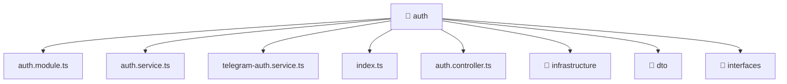

[🏠 Home](../../../../README.md) > [backend](../../../README.md) > [src](../../README.md) > [modules](../README.md) > [auth](./README.md)

# 📁 auth

### 🎯 PURPOSE
Welcome to the exquisite **auth** module of the Mavluda Beauty ecosystem. This directory focuses on orchestrating Business Services, HTTP APIs. It is designed adhering to our 'Luxury Professional' standards.

### 🏗️ ARCHITECTURE


### 📄 FILE REGISTRY
| File Name | Type | Responsibility | Key Aliases Used |
|---|---|---|---|
| `auth.controller.ts` | NestJS Controller | Handles incoming HTTP requests Defines classes: AuthController. | @common |
| `auth.module.ts` | Angular Module | Configures an application module or layer Defines classes: AuthModule. | @nestjs, @modules, @common |
| `auth.service.ts` | Angular Service | Provides injectable business logic or services Defines classes: AuthService. | @nestjs, @modules |
| `index.ts` | TypeScript File | Exports or orchestrates module members. | None |
| `telegram-auth.service.ts` | Angular Service | Provides injectable business logic or services Defines classes: TelegramAuthService. | @nestjs, @modules, @common |

### 🔗 DEPENDENCIES
- `@common/config/app-config.module`
- `@common/config/app-config.service`
- `@common/decorators/public.decorator`
- `@modules/user`
- `@nestjs/common`
- `@nestjs/jwt`
- `@nestjs/passport`
- `bcrypt`
- `crypto`

### 🛠️ USAGE
```typescript
// Example interaction or integration snippet
// Import members from auth based on module boundaries
```
