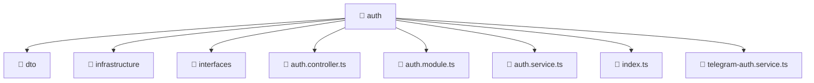

# 📁 Mavluda Beauty auth

[backend](/backend) / [src](/backend/src) / [modules](/backend/src/modules) / [auth](/backend/src/modules/auth)

## 🎯 Purpose
Delivering luxury-tier architectural components and high-performance logic for the **auth** domain. This directory is a crucial part of the Mavluda Beauty full-stack ecosystem, ensuring seamless scalability, robust performance, and an elite digital experience.

## 🏗️ Architecture


## 📄 File Registry
| File Name | Type | Responsibility | Key Aliases Used |
|---|---|---|---|
| `auth.controller.ts` | Controller | Handles HTTP requests and orchestrates responses. | `@nestjs/common, @common/decorators/public.decorator` |
| `auth.module.ts` | Module | Groups related capabilities and defines dependencies. | `@nestjs/common, @modules/user, @nestjs/passport, @nestjs/jwt, @common/config/app-config.module, @common/config/app-config.service` |
| `auth.service.ts` | Service | Encapsulates business logic and API calls. | `@nestjs/common, @modules/user, @nestjs/jwt` |
| `index.ts` | TypeScript Logic | Core logic and utilities for this domain. | N/A |
| `telegram-auth.service.ts` | Service | Encapsulates business logic and API calls. | `@nestjs/common, @common/config/app-config.service, @modules/user` |


## 🔗 Dependencies
**Path Aliases:**
- `@nestjs/common`
- `@common/decorators/public.decorator`
- `@modules/user`
- `@nestjs/passport`
- `@nestjs/jwt`
- `@common/config/app-config.module`
- `@common/config/app-config.service`

**External Packages:**
- `bcrypt`
- `crypto`


## 🛠️ Usage
```typescript
// Example integration for auth
// Import capabilities from this directory to enrich your modules.
```
> This directory provides specialized logic tailored to the Mavluda Beauty standard.
