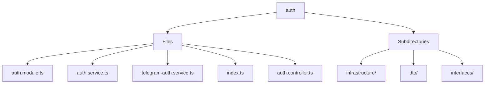

# 🏷️ Auth Directory

> *Elegance, Precision, and Luxury Professionalism — The Mavluda Beauty Standard.*

## 🧭 Breadcrumb Navigation
[backend](/backend) ➔ [src](/backend/src) ➔ [modules](/backend/src/modules) ➔ [auth](/backend/src/modules/auth)

## 🎯 Purpose
This directory encapsulates the essential architecture and logic for the **Auth** domain within the Mavluda Beauty ecosystem. It serves as a foundational component ensuring robust, scalable, and elegant operations.

## 🏗️ Architecture


## 📄 File Registry
| File Name | Type | Responsibility | Key Aliases Used |
|---|---|---|---|
| `auth.module.ts` | TypeScript | Exports: AuthModule | @common, @modules |
| `auth.service.ts` | TypeScript | Exports: AuthService | @modules |
| `telegram-auth.service.ts` | TypeScript | Exports: TelegramAuthService | @common, @modules |
| `index.ts` | TypeScript | Defines logic and structure for index.ts. | None |
| `auth.controller.ts` | TypeScript | Exports: AuthController | @common |

## 🔗 Dependencies
- `@common/config/app-config.module`
- `@common/config/app-config.service`
- `@common/decorators/public.decorator`
- `@modules/user`
- `@nestjs/common`
- `@nestjs/jwt`
- `@nestjs/passport`
- `bcrypt`
- `crypto`

## 🛠️ Usage
```typescript
// To utilize the luxurious capabilities of this module:
import { AuthModule } from './path/to/authmodule';

// Ensure properly typed interactions per Mavluda Beauty standards
```
