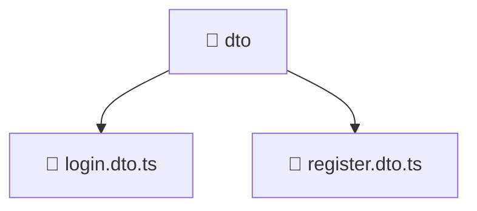

<!--
Mavluda Beauty - Luxury Professional Documentation
Generated for 100% Architectural Transparency
-->
[Home](../../../../../README.md) > [backend](../../../../README.md) > [src](../../../README.md) > [modules](../../README.md) > [auth](../README.md) > [dto](./README.md)

# 📁 DTO Directory

## 🎯 PURPOSE
Manages the dto module, providing robust and secure backend services for the Mavluda Beauty application.

## 🏗️ ARCHITECTURE


## 📄 FILE REGISTRY
| File Name | Type | Responsibility | Key Aliases Used |
|---|---|---|---|
| `login.dto.ts` | TypeScript | Data Transfer Object definition. | - |
| `register.dto.ts` | TypeScript | Data Transfer Object definition. | - |


## 🔗 DEPENDENCIES
- `class-validator`

## 🛠️ USAGE
```typescript
// Example placeholder for interacting with dto
// Consult the individual files in the registry for specific APIs.
```
