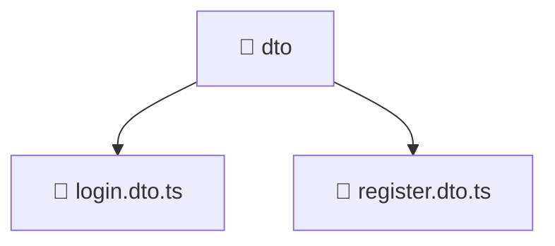

# 📁 dto

[Root](/../../../../../README.md) / [backend](../../../../README.md) / [src](../../../README.md) / [modules](../../README.md) / [auth](../README.md) / [dto](./README.md)

## 🎯 Purpose
Delivering luxury-tier architectural components and high-performance logic for the **dto** domain. This directory is a crucial part of the Mavluda Beauty full-stack ecosystem, ensuring seamless scalability, robust performance, and an elite digital experience.

## 🏗️ Architecture


## 📄 File Registry
| File Name | Type | Responsibility | Key Aliases Used |
|---|---|---|---|
| `login.dto.ts` | DTO | Provides core logic and orchestration for login.dto.ts. | N/A |
| `register.dto.ts` | DTO | Provides core logic and orchestration for register.dto.ts. | N/A |


## 🔗 Dependencies
**External:**
- `class-validator`


## 🛠️ Usage
```typescript
// Example usage within the Mavluda Beauty ecosystem
import { relevantMember } from './login.dto';

// Integrate into the application architecture
relevantMember.execute();
```
