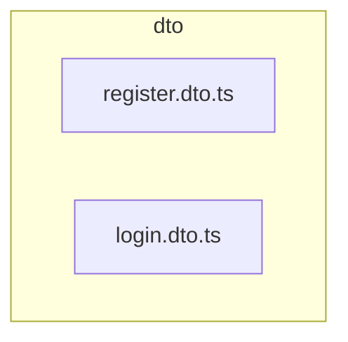

# 📦 dto

[backend](../../../../README.md) > [src](../../../README.md) > [modules](../../README.md) > [auth](../README.md) > [dto](README.md)

---

### 🎯 PURPOSE
Elevating the digital experience for the Mavluda Beauty ecosystem, this module manages the sophisticated Feature Module Layer (Bounded Contexts) operations.

*FSD Layer:* **Feature Module Layer (Bounded Contexts)**

---

### 🏗️ ARCHITECTURE



---

### 📄 FILE REGISTRY
| File Name | Type | Responsibility | Key Aliases Used |
|-----------|------|----------------|------------------|
| `register.dto.ts` | DTO | Handles dto logic for Mavluda Beauty's luxury standards. | `None` |
| `login.dto.ts` | DTO | Handles dto logic for Mavluda Beauty's luxury standards. | `None` |

---

### 🔗 DEPENDENCIES
Notable imports:
- `class-validator`

---

### 🛠️ USAGE
To interact with this directory's luxurious logic, integrate its exported components or services directly into your feature modules. Ensure strict adherence to the Feature Module Layer (Bounded Contexts) boundaries.

```typescript
// Example integration snippet
import { FeatureModule } from '@path/to/dto';
```
