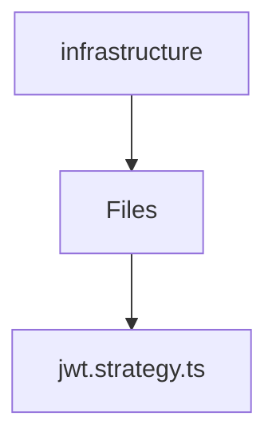

# 🏷️ Infrastructure Directory

> *Elegance, Precision, and Luxury Professionalism — The Mavluda Beauty Standard.*

## 🧭 Breadcrumb Navigation
[backend](/backend) ➔ [src](/backend/src) ➔ [modules](/backend/src/modules) ➔ [auth](/backend/src/modules/auth) ➔ [infrastructure](/backend/src/modules/auth/infrastructure)

## 🎯 Purpose
This directory encapsulates the essential architecture and logic for the **Infrastructure** domain within the Mavluda Beauty ecosystem. It serves as a foundational component ensuring robust, scalable, and elegant operations.

## 🏗️ Architecture


## 📄 File Registry
| File Name | Type | Responsibility | Key Aliases Used |
|---|---|---|---|
| `jwt.strategy.ts` | TypeScript | Exports: JwtStrategy | @common |

## 🔗 Dependencies
- `@common/config/app-config.service`
- `@nestjs/common`
- `@nestjs/passport`
- `passport-jwt`

## 🛠️ Usage
```typescript
// To utilize the luxurious capabilities of this module:
import { JwtStrategy } from './path/to/jwtstrategy';

// Ensure properly typed interactions per Mavluda Beauty standards
```
