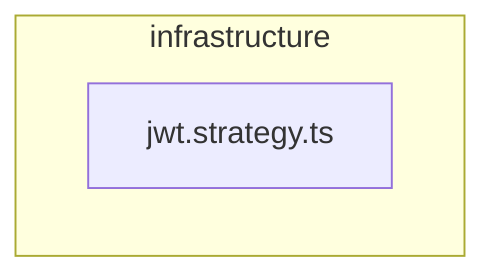

# 🏗️ infrastructure

[backend](../../../../README.md) > [src](../../../README.md) > [modules](../../README.md) > [auth](../README.md) > [infrastructure](README.md)

---

### 🎯 PURPOSE
Elevating the digital experience for the Mavluda Beauty ecosystem, this module manages the sophisticated Infrastructure Layer (External systems, DBs, frameworks) operations.

*FSD Layer:* **Infrastructure Layer (External systems, DBs, frameworks)**

---

### 🏗️ ARCHITECTURE



---

### 📄 FILE REGISTRY
| File Name | Type | Responsibility | Key Aliases Used |
|-----------|------|----------------|------------------|
| `jwt.strategy.ts` | Source | Handles source logic for Mavluda Beauty's luxury standards. | `@common, @nestjs` |

---

### 🔗 DEPENDENCIES
**Key Path Aliases Detected:** `@common`, `@nestjs`

Notable imports:
- `../interfaces/jwt-payload.interface`
- `passport-jwt`
- `@nestjs/common`
- `@common/config/app-config.service`
- `@nestjs/passport`

---

### 🛠️ USAGE
To interact with this directory's luxurious logic, integrate its exported components or services directly into your feature modules. Ensure strict adherence to the Infrastructure Layer (External systems, DBs, frameworks) boundaries.

```typescript
// Example integration snippet
import { FeatureModule } from '@path/to/infrastructure';
```
