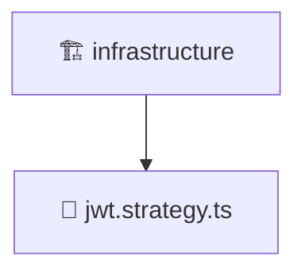

# 🏗️ infrastructure

[Root](/../../../../../README.md) / [backend](../../../../README.md) / [src](../../../README.md) / [modules](../../README.md) / [auth](../README.md) / [infrastructure](./README.md)

## 🎯 Purpose
Delivering luxury-tier architectural components and high-performance logic for the **infrastructure** domain. This directory is a crucial part of the Mavluda Beauty full-stack ecosystem, ensuring seamless scalability, robust performance, and an elite digital experience.

## 🏗️ Architecture


## 📄 File Registry
| File Name | Type | Responsibility | Key Aliases Used |
|---|---|---|---|
| `jwt.strategy.ts` | TypeScript | Provides core logic and orchestration for jwt.strategy.ts. | @common, @nestjs |


## 🔗 Dependencies
**Internal / Aliases:**
- `../interfaces/jwt-payload.interface`
- `@common/config/app-config.service`
- `@nestjs/common`
- `@nestjs/passport`

**External:**
- `passport-jwt`


## 🛠️ Usage
```typescript
// Example usage within the Mavluda Beauty ecosystem
import { relevantMember } from './jwt.strategy';

// Integrate into the application architecture
relevantMember.execute();
```
