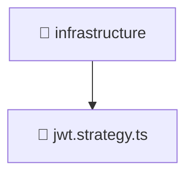

### 🧭 Breadcrumbs
[Root](/) > [backend](/backend) > [src](/backend/src) > [modules](/backend/src/modules) > [auth](/backend/src/modules/auth) > [infrastructure](/backend/src/modules/auth/infrastructure)

# 📁 Infrastructure Directory
**Architecture Layer:** Domain/Infrastructure Layer

## 🎯 Purpose
Provides luxury professional architectural implementation for the infrastructure module within the Mavluda Beauty ecosystem. Ensure robust functionality and elegant integration with the broader architecture.

## 🏗️ ARCHITECTURE


## 📄 FILE REGISTRY
| File Name | Type | Responsibility | Key Aliases Used |
|---|---|---|---|
| `jwt.strategy.ts` | TypeScript | Provides core logic and orchestration for jwt.strategy.ts. | @nestjs/passport, @common/config/app-config.service, @nestjs/common |

## 🔗 DEPENDENCIES
- `@common/config/app-config.service`
- `@nestjs/common`
- `@nestjs/passport`

## 🛠️ USAGE
```typescript
// Example architectural integration for infrastructure
// Utilize the exported members according to Mavluda Beauty's standard conventions.
```

---
*Maintained by Mavluda Beauty - Architecture & Engineering*

---
*Maintained by Mavluda Beauty - Architecture & Engineering*