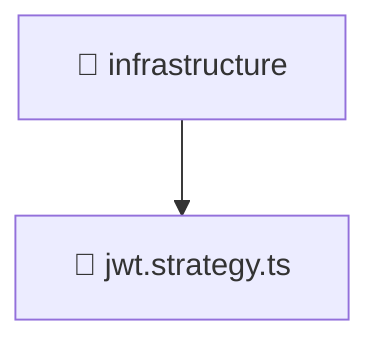

# 📁 infrastructure

[Root](/.) > [backend](/backend) > [src](/backend/src) > [modules](/backend/src/modules) > [auth](/backend/src/modules/auth) > [infrastructure](/backend/src/modules/auth/infrastructure)

## 🎯 Purpose
Backend module defining application routes, business logic, and data access for the domain.

## 🏗️ Architecture


## 📄 File Registry
| File Name | Type | Responsibility | Key Aliases Used |
|---|---|---|---|
| `jwt.strategy.ts` | TypeScript | Provides core logic and orchestration for jwt.strategy.ts. | @common, @nestjs |

## 🔗 Dependencies
- `../interfaces/jwt-payload.interface`
- `@common/config/app-config.service`
- `@nestjs/common`
- `@nestjs/passport`
- `passport-jwt`

## 🛠️ Usage
```typescript
import { Module } from '@nestjs/common';
// Import specific services/controllers provided by this module
```
