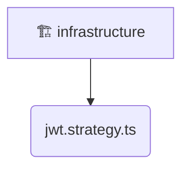

# [backend](/backend) / [src](/backend/src) / [modules](/backend/src/modules) / [auth](/backend/src/modules/auth) / [infrastructure](/backend/src/modules/auth/infrastructure)

## 🏷️ 🏗️ Infrastructure

### 🎯 PURPOSE
The `infrastructure` directory forms a critical foundation within the Mavluda Beauty ecosystem, meticulously orchestrating the infrastructure logic to ensure a seamless and premium experience. Rooted in the NestJS backend architecture, it delivers robust, high-performance operations tailored for high-end beauty and wedding services.

### 🏗️ ARCHITECTURE


### 📄 FILE REGISTRY
| File Name | Type | Responsibility | Key Aliases Used |
|---|---|---|---|
| `jwt.strategy.ts` | `ts` | Encapsulates premium logic and definitions for `jwt.strategy.ts`. | @nestjs/passport, @nestjs/common, @common/config/app-config.service |


### 🔗 DEPENDENCIES
- `@common/config/app-config.service`
- `@nestjs/common`
- `@nestjs/passport`

### 🛠️ USAGE
```typescript
// Seamlessly integrate infrastructure into your refined workflows:
import { /* exported members */ } from '@path/to/infrastructure';
```
