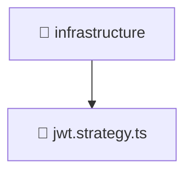

# 📁 infrastructure

[Root](/.) > [backend](/backend) > [src](/backend/src) > [modules](/backend/src/modules) > [auth](/backend/src/modules/auth) > [infrastructure](/backend/src/modules/auth/infrastructure)

## 🎯 Purpose
Delivering luxury-tier architectural components and high-performance logic for the **infrastructure** domain. This directory is a crucial part of the Mavluda Beauty full-stack ecosystem, ensuring seamless scalability, robust performance, and an elite digital experience.
> **FSD Layer:** Modules (Backend FSD) - Adhering to strict Feature Sliced Design architectural constraints.

## 🏗️ Architecture


## 📄 File Registry
| File Name | Type | Responsibility | Key Aliases Used |
|---|---|---|---|
| `jwt.strategy.ts` | File | Core logic and utilities for this domain. | @nestjs, @common |


## 🔗 Dependencies
- `passport-jwt`
- `@nestjs/passport`
- `@nestjs/common`
- `@common/config/app-config.service`
- `../interfaces/jwt-payload.interface`

## 🛠️ Usage
```typescript
// Example usage within the Mavluda Beauty ecosystem
import { relevantMember } from './jwt.strategy';

// Integrate into the application architecture
relevantMember.execute();
```
