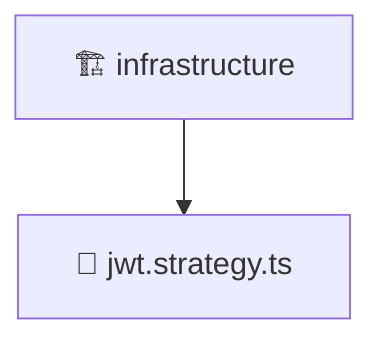

# 🏗️ Mavluda Beauty infrastructure

[backend](/backend) / [src](/backend/src) / [modules](/backend/src/modules) / [auth](/backend/src/modules/auth) / [infrastructure](/backend/src/modules/auth/infrastructure)

## 🎯 Purpose
Delivering luxury-tier architectural components and high-performance logic for the **infrastructure** domain. This directory is a crucial part of the Mavluda Beauty full-stack ecosystem, ensuring seamless scalability, robust performance, and an elite digital experience.

## 🏗️ Architecture


## 📄 File Registry
| File Name | Type | Responsibility | Key Aliases Used |
|---|---|---|---|
| `jwt.strategy.ts` | TypeScript Logic | Core logic and utilities for this domain. | `@nestjs/passport, @nestjs/common, @common/config/app-config.service` |


## 🔗 Dependencies
**Path Aliases:**
- `@nestjs/passport`
- `@nestjs/common`
- `@common/config/app-config.service`

**External Packages:**
- `passport-jwt`


## 🛠️ Usage
```typescript
// Example integration for infrastructure
// Import capabilities from this directory to enrich your modules.
```
> This directory provides specialized logic tailored to the Mavluda Beauty standard.
