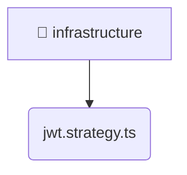

# [root](/) / [backend](/backend) / [src](/backend/src) / [modules](/backend/src/modules) / [auth](/backend/src/modules/auth) / [infrastructure](/backend/src/modules/auth/infrastructure)

## 🏷️ 📁 Infrastructure

### 🎯 PURPOSE
The `infrastructure` directory forms a critical foundation within the Mavluda Beauty ecosystem, meticulously orchestrating the infrastructure logic to ensure a seamless and premium experience.

### 🏗️ ARCHITECTURE


### 📄 FILE REGISTRY
| File Name | Type | Responsibility | Key Aliases Used |
|---|---|---|---|
| `jwt.strategy.ts` | `ts` | Core logic implementation. | @nestjs, @common |

### 🔗 DEPENDENCIES
- `../interfaces/jwt-payload.interface`
- `@common/config/app-config.service`
- `@nestjs/common`
- `@nestjs/passport`
- `passport-jwt`

### 🛠️ USAGE
```typescript
// Seamlessly integrate infrastructure into your refined workflows:
import { /* exported members */ } from '@path/to/infrastructure';
```
