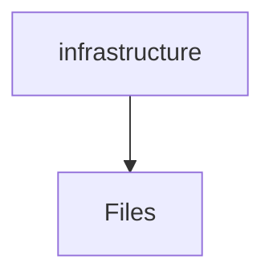
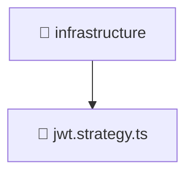

# 🏗️ Infrastructure Directory

[backend](/backend) > [src](/backend/src) > [modules](/backend/src/modules) > [auth](/backend/src/modules/auth) > [infrastructure](/backend/src/modules/auth/infrastructure)

## 🎯 Purpose
A high-level module handling `infrastructure` logic within the Mavluda Beauty ecosystem. This directory adheres to our "Luxury Professional" architectural standards.


## 🏗️ Architecture



## 📄 File Registry
| File Name | Type | Responsibility | Key Aliases Used |
|-----------|------|----------------|------------------|
| `jwt.strategy.ts` | TypeScript | Provides localized typescript definitions. | @nestjs/passport, @common/config/app-config.service, @nestjs/common |

## 🔗 Dependencies
- `@common/config/app-config.service`
- `@nestjs/common`
- `@nestjs/passport`

## 🛠️ Usage
```typescript
// Architectural overview snippet
import { InternalLogic } from './internal-file';
// Ensure adherence to Hexagonal / FSD principles
```

## 📝 Existing Context
# 📁 infrastructure

[Root](/.) > [backend](/backend) > [src](/backend/src) > [modules](/backend/src/modules) > [auth](/backend/src/modules/auth) > [infrastructure](/backend/src/modules/auth/infrastructure)

## 🎯 Purpose
Delivering luxury-tier architectural components and high-performance logic for the **infrastructure** domain. This directory is a crucial part of the Mavluda Beauty full-stack ecosystem, ensuring seamless scalability, robust performance, and an elite digital experience.

## 🏗️ Architecture


## 📄 File Registry
| File Name | Type | Responsibility | Key Aliases Used |
|---|---|---|---|
| `jwt.strategy.ts` | TypeScript | Provides core logic and orchestration for jwt.strategy.ts. | @common, @nestjs |

## 🔗 Dependencies
- `../interfaces/jwt-payload.interface`
- `@common/config/app-config.service`
- `@nestjs/common`
- `@nestjs/passport`
- `passport-jwt`

## 🛠️ Usage
```typescript
// Example usage within the Mavluda Beauty ecosystem
import { relevantMember } from './infrastructure';

// Integrate into the application architecture
relevantMember.execute();
```
